

  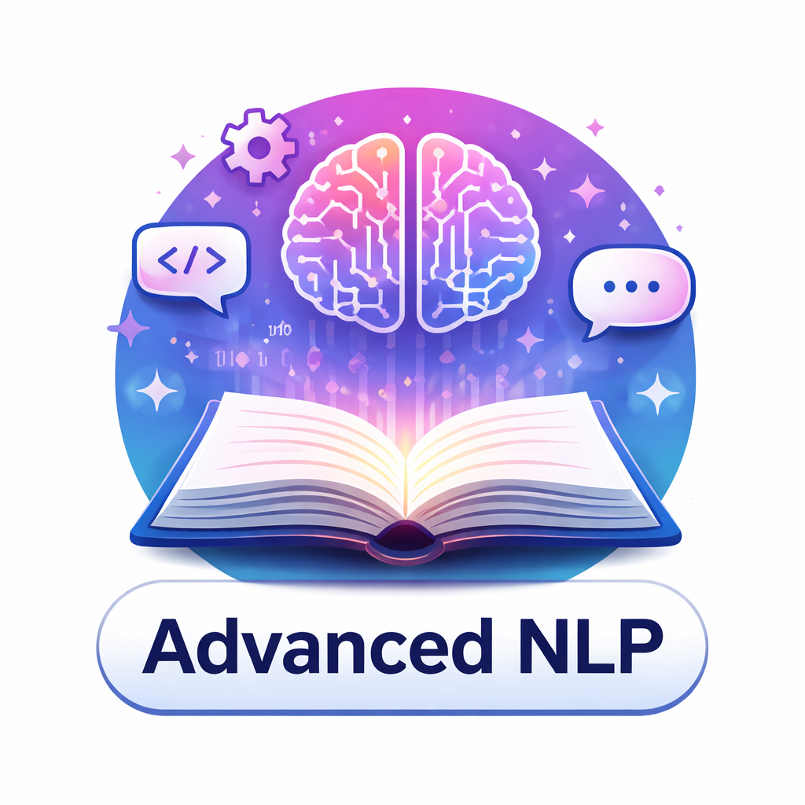

------

### Code for LUH Advanced NLP, Summer Semester 2026 (SoSe 26)

Course Lecturer: [Jennifer D'Souza](https://sites.google.com/view/jen-web/)

Course website: https://sites.google.com/view/jen-web/sose-2026

------

Course Exercise Instructors:

- Hamed Babaei Giglou
- Sameer Sadruddin

------

Code examples associated with a lecture are in the directory prefixed with the lecture's number. Lecture topics and associated code examples are as follows:

|                                                                               | Topic Title                                                                          | Description                                                                                                                                                                                                                                                                                                                                                                                                                                                                                                                                                                                                                                                                                                                                                                                                                                                                                                                                                                            |
|:-----------------------------------------------------------------------------:|--------------------------------------------------------------------------------------|----------------------------------------------------------------------------------------------------------------------------------------------------------------------------------------------------------------------------------------------------------------------------------------------------------------------------------------------------------------------------------------------------------------------------------------------------------------------------------------------------------------------------------------------------------------------------------------------------------------------------------------------------------------------------------------------------------------------------------------------------------------------------------------------------------------------------------------------------------------------------------------------------------------------------------------------------------------------------------------|
|        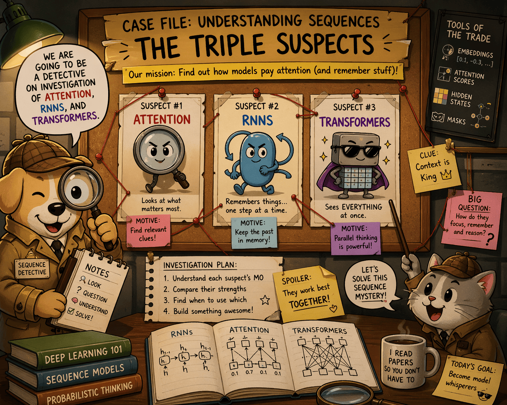        | [Lecture 1: Introduction](01_intro/README.md)                                        | This introductory lecture focuses on foundational NLP techniques. You will learn about rule-based and simple statistical methods for text classification, such as building a rule-based sentiment classifier using hand-crafted features and feature weights, and training a bag-of-words classifier using a structured perceptron algorithm. The lecture highlights the limitations of these classical approaches, particularly their lack of generalizability and reliance on manual feature engineering. By completing this lecture, you will be able to implement simple NLP systems and analyze their performance, establishing a baseline for understanding modern deep learning-based approaches.                                                                                                                                                                                                                                                                               |
|    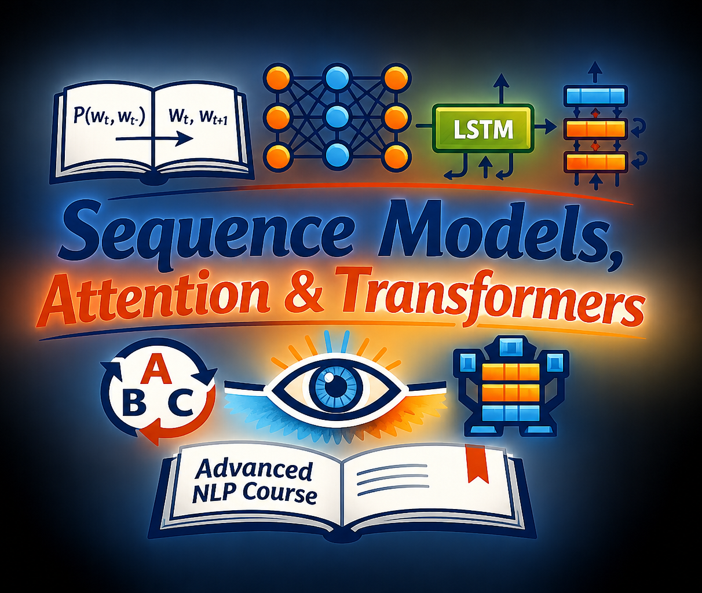     | [Lecture 2: Sequence Models, Attention, and Transformers](02_transformers/README.md) | This lecture covers the shift from traditional NLP to deep learning. You will explore neural network architectures for language modeling, including recurrent neural networks and the novel transformer architecture. The goal of this lecture is to illustrate how deep learning approaches overcome the limitations of classical NLP methods by automatically learning meaningful features and representations from data. You will gain a theoretical and practical understanding of key advancements that have propelled the field toward LLMs. After finishing this lecture, you will be able to build basic neural language models and appreciate the power of attention mechanisms.                                                                                                                                                                                                                                                                                              |
|     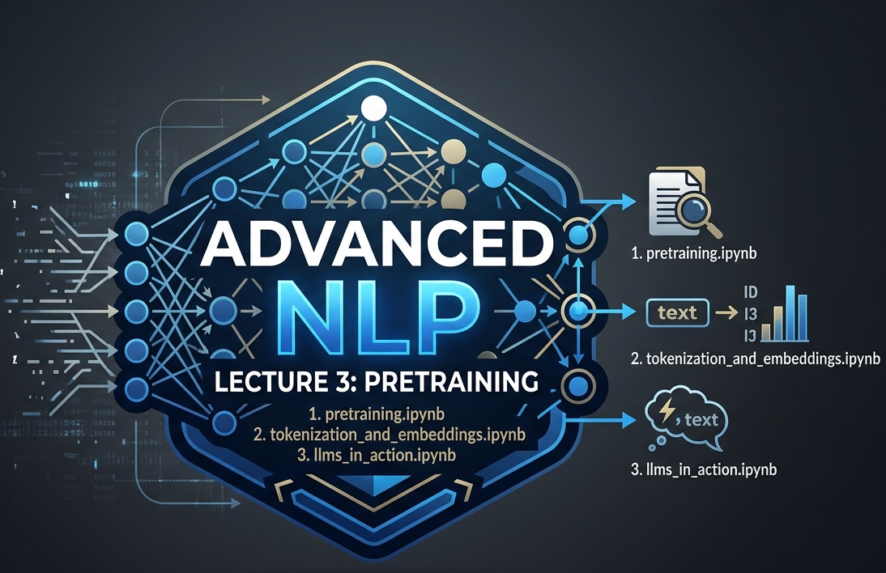     | [Lecture 3: Pretraining](03_pretraining/README.md)                                   | This lecture serves as a deep dive into the initial, critical phase of creating a LLM. It explores how massive text corpora are translated into machine-understandable data and how foundational models are structured. We focus heavily on the 'why' and 'how' of modern data representation, moving from simple vectorization to contextual embeddings, and examining real-world, messy pretraining data. You will gain a practical understanding of tokenization mechanics (like BPE), embedding spaces, and the specific objectives, such as Masked Language Modeling, used to train models like BERT and its derivatives. By the end of this lecture, you will be able to load, process, and analyze the very data that creates the 'brain' of an LLM. More ot this, we will dive in to action showcasing a reallife use-case of LLMs and introducing an embedding library.                                                                                                       |
|     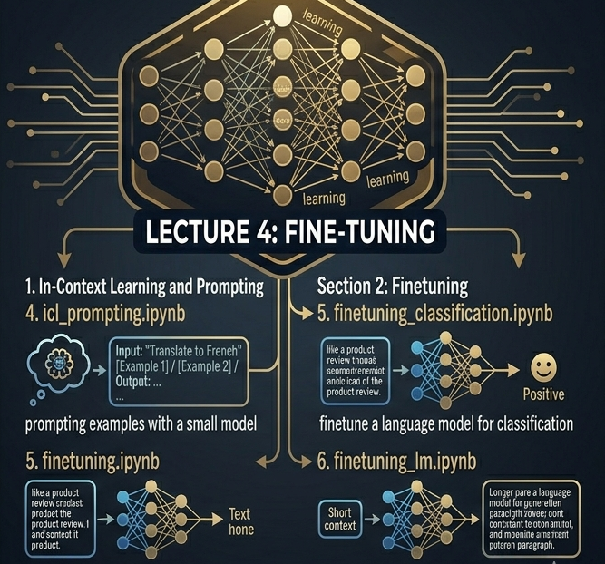      | [Lecture 4: Finetuning](04_finetuning/README.md)                                     | This lecture covers the essential techniques used to transform a general-purpose, pretrained model into a highly effective tool for specific, downstream tasks. We introduce two major paradigms of model customization: In-Context Learning (ICL) and parameter-efficient Fine-tuning. The primary goal is to provide hands-on experience in adapting models for both discriminative tasks (like sentence classification) and generative tasks (like dialogue generation or summarization). You will learn how to properly construct few-shot prompts to harness a model's latent capabilities without retraining, and how to execute supervised fine-tuning loops to update model weights for specialized datasets. This lecture equips you to practically apply and optimize LLMs for targeted applications.  In the end there will be some tips and advises on how run a large-scale finetuning and what to consider.                                                              |
|      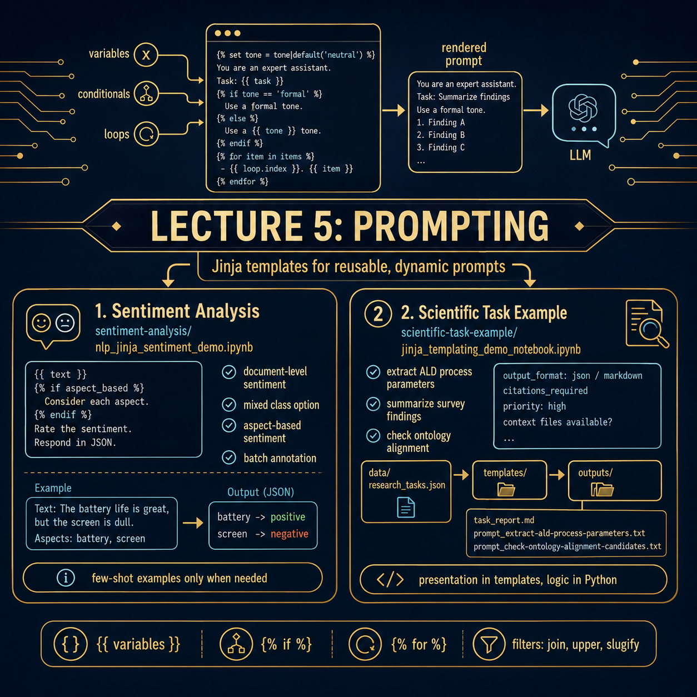      | [Lecture 5: Prompting](05_prompting/README.md)                                       | This lecture introduces prompting as a way to guide pretrained language models by providing task-specific instructions and input context. The accompanying exercises focus on using Jinja templates to create reusable, and dynamic prompts. Through two examples, students learn how templating can separate prompt logic from data: a sentiment analysis exercise demonstrates prompt variants for document-level, mixed-label, aspect-based, and batch classification, while a scientific task example shows how templates can generate prompts and reports for research-oriented information extraction tasks with conditional logic, loops, filters, output-format requirements, citations, and context-dependent instructions.                                                                                                                                                                                                                                                   |
| 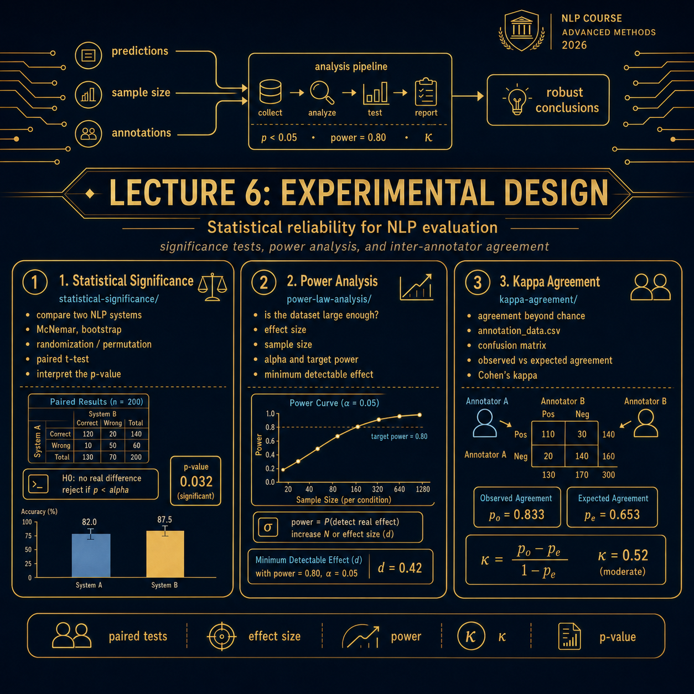 | [Lecture 6: Experimental Design](06_experimental_design/README.md)                   | This lecture introduces experimental design as a way to make NLP evaluation more reliable and interpretable. The accompanying exercises focus on three practical aspects of experimental reliability: a statistical significance exercise shows how to test whether observed differences between NLP systems are likely to be meaningful, a power analysis exercise demonstrates how to estimate whether an evaluation dataset is large enough to detect expected performance differences, and a kappa agreement exercise shows how Cohen’s kappa can be used to measure inter-annotator agreement beyond chance.                                                                                                                                                                                                                                                                                                                                                                      |
|         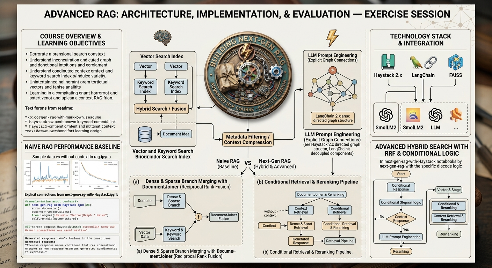         | [Lecture 7: RAG](07_rag/README.md)                                                   | This exercise session details the transition from Naive RAG to Advanced Hybrid RAG architectures. Students first explore a baseline Naive RAG system using rag.ipynb, which directly injects raw external document lookups into a generation prompt without refinement. The lecture then introduces "Next-Gen" engineering practices—such as conditional retrieval, document reranking, and context compression—designed to optimize the retrieval layer. Specifically, it highlights Hybrid Search, which merges sparse (BM25 keyword) and dense (Faiss semantic vector) retrieval branches using Reciprocal Rank Fusion (RRF). This advanced blueprint is implemented and compared across two ecosystems: `next-gen-rag-with-Haystack.ipynb`, which wires components via explicit directed graphs, and `next-gen-rag-with-LangChain.ipynb`, which structures decoupled components using LangChain Expression Language (LCEL) pipelines.                                              |
|         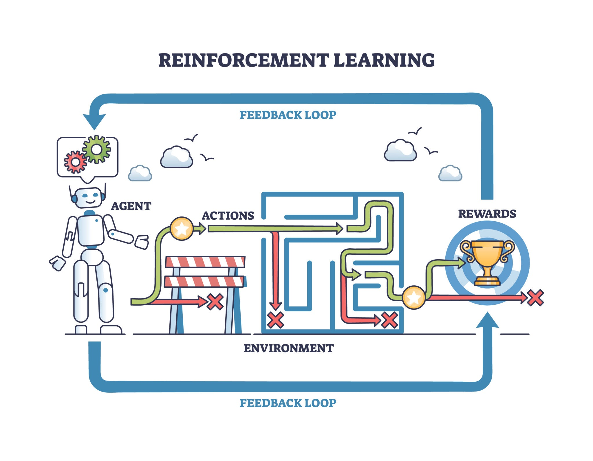         | [Lecture 8: RL](08_rl/README.md)                                                     | This lecture introduces the fundamentals of reinforcement learning (RL) and its application to both classical control problems and large language models (LLMs). Students begin by learning policy gradient methods using the CartPole environment, comparing implementations with and without a learned value function to understand how value estimation improves learning efficiency. The lecture then extends these concepts to RL-based fine-tuning of LLMs, demonstrating a complete workflow that includes supervised fine-tuning (SFT), PPO-style reinforcement learning, model evaluation, and hands-on experimentation through Jupyter notebooks. By the end of the lecture, students will understand the core principles of reinforcement learning, implement and evaluate policy gradient algorithms, explain the role of value functions and PPO in optimization, and apply reinforcement learning techniques to fine-tune and assess language models for specific tasks. |
|   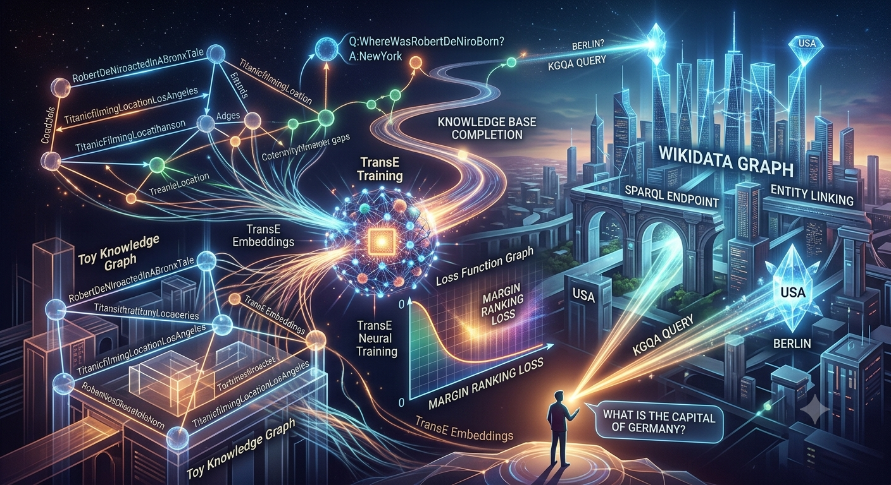    | [Lecture 9: Knowledge Bases](09_knowledge_base/README.md)                                        | This lecture exercise dives into knowledge graph embeddings and KQ question answering. The Knowledge Graph Embeddings convert entities and relationships into numerical vectors to help machines understand and predict connections in knowledge graphs. The TransE model trains these embeddings by learning entity–relation patterns using a Margin Ranking Loss function, enabling knowledge completion and link prediction. These embeddings can scale to large graphs like Wikidata, where KGQA systems use entity linking and SPARQL queries to answer natural language questions by finding the correct information, such as identifying Berlin as the capital of Germany.                                                                                                                                                                                                                                                                                                     |
|   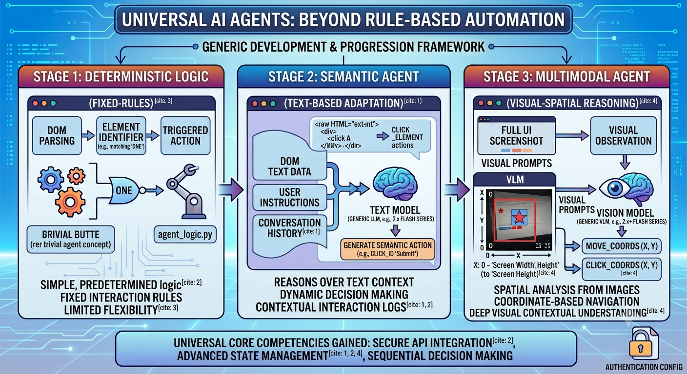    | [Lecture 10: Agents](10_agents/README.md)                                        |In these exercises, you will learn how to build, configure, and evaluate different web-navigating agents using `Gymnasium` and the `MiniWoB` benchmark. They will start by building a deterministic, rule-based agent that parses basic DOM elements to trigger hardcoded clicks. Next, they will transition to an LLM-driven agent using `gemini-2.0-flash` to dynamically translate raw HTML DOM data, user instructions, and action history into text-based web actions. Finally, we will implement a multimodal Vision-Language Model agent using `gemini-2.5-flash`. This final agent will teach them how to process visual screenshots alongside text prompts, allowing the agent to perform spatial reasoning and interact with the webpage using coordinate-based clicks. Throughout the exercises, you will gain practical experience in API integration, environment state management, and handling sequential action histories.  |

------
